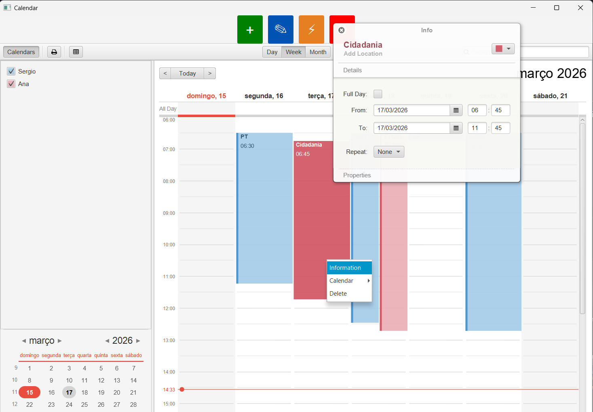
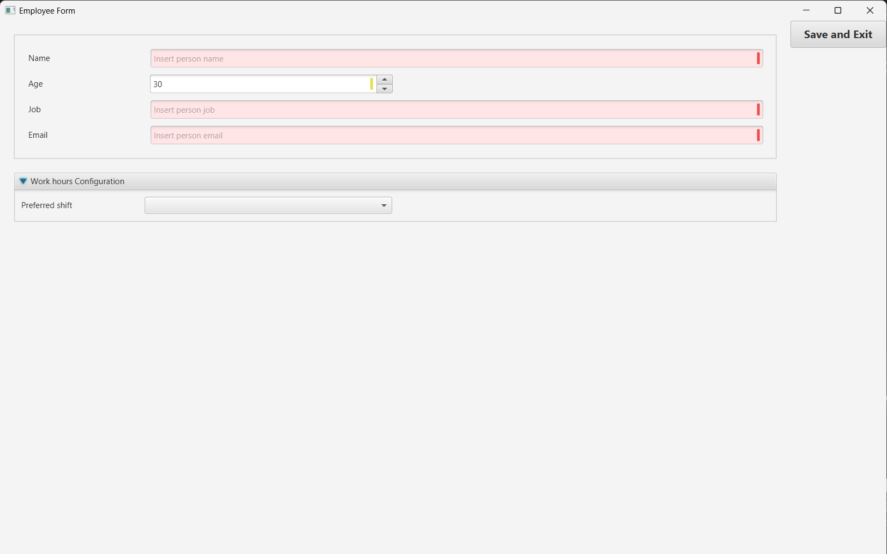
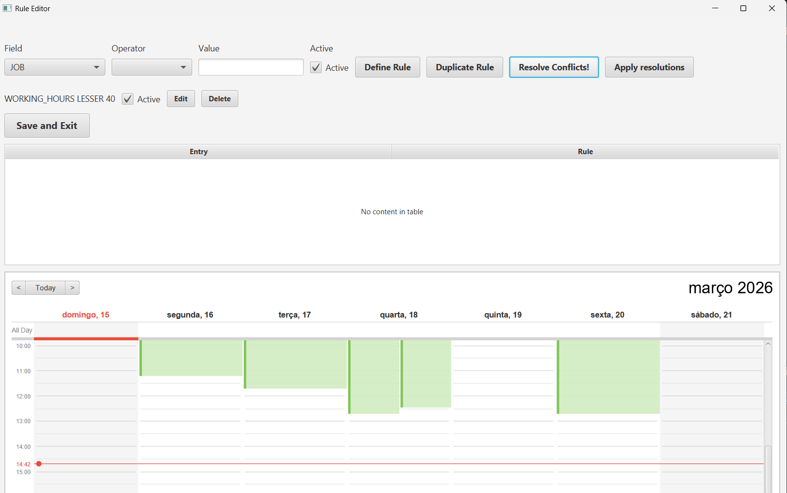
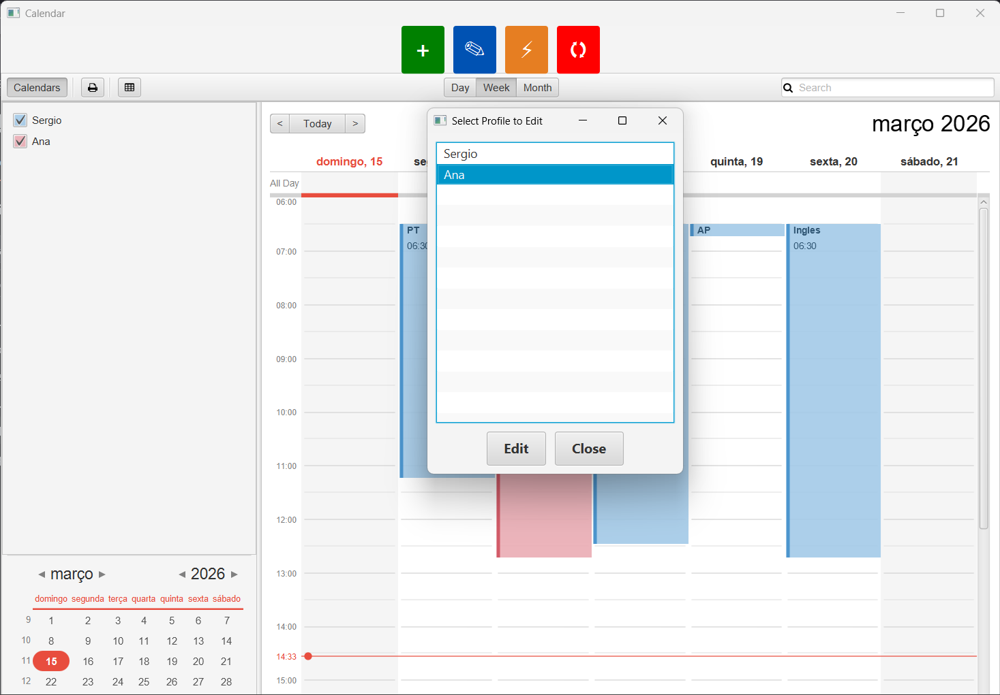

# Horaccio - Schedule Management Application

## Overview

**Horaccio** is an open-source schedule management desktop application designed to help organizations manage employee schedules, detect scheduling conflicts, and resolve them based on customizable business rules. Built with JavaFX, it provides an intuitive interface for calendar management, employee profile management, and advanced conflict resolution.

---

## Quick Start (5 Minutes)

### 1. Launch Application
```bash
mvn clean install
mvn javafx:run
```

### 2. The Main Screen
- **Left**: Calendar list  
- **Center**: Calendar view  
- **Top**: Action buttons  
- **Right**: Details panel

### 3. Quick Actions

| Action | Button | Shortcut |
|--------|--------|----------|
| Add Event | + (Green) | Ctrl+N |
| Edit Event | ✏️ (Blue) | Double-click event |
| Delete Event | 🗑️ (Red) | Delete key |
| Show Rules | ⚙️ (Gray) | Ctrl+R |
| Check Conflicts | ⚠️ (Orange) | Ctrl+K |
| Refresh Calendar | 🔄 (Blue) | F5 |

---

## Key Features

### 1. **Calendar Management**
- Comprehensive calendar view with day, week, and detailed week display options
- Support for multiple calendars organized by calendar sources
- Easy navigation through dates and time periods
- Persistent calendar data using JSON serialization

### 2. **Event Management**
- Create, edit, and delete calendar events
- Support for multi-day events
- Visual conflict indicators for scheduling issues
- Event details display with entry information



### 3. **Employee Profile Management**
- Maintain detailed employee profiles with personal information
- Configure working hours preferences
- Set preferred shift times
- Manage job titles and contact information
- Store employee email addresses



### 4. **Conflict Detection & Resolution**
- Automatic detection of scheduling conflicts based on defined rules
- Intelligent conflict resolution calculator
- Conflict highlighting and warnings
- Real-time conflict status tracking

### 5. **Advanced Rule Editor**
- Create custom conflict resolution rules using conditions
- Define rules based on employee attributes (name, working hours, preferred shift, job, email)
- Set operators: EQUALS, NOT_EQUALS, GREATER, LESSER
- Toggle rules active/inactive without deleting
- Apply rules to automatically resolve conflicts



### 6. **Data Persistence**
- Automatic saving of calendar data to JSON format
- Employee profile persistence
- Rule configuration storage
- Import/export capabilities

---

## How to Use

### Managing Calendars & Events

#### Add a New Event
1. Click the **Add Button** (green '+' icon) in the toolbar
2. Enter event details such as:
   - Event title/name
   - Date and time
   - Duration
   - Associated employee
3. Click **Save** to add to calendar



#### Edit an Event
1. Double-click on an event in the calendar view
2. Modify the event details
3. Click **Save** to apply changes

#### Delete an Event
1. Select the event
2. Press Delete or use context menu
3. Confirm deletion

### Managing Employee Profiles

1. **Add Employee Profile**
   - Click "Employee Form" button
   - Fill in employee information:
     - Name
     - Job title
     - Working hours (e.g., 9:00 AM - 5:00 PM)
     - Preferred shift
     - Email address

2. **Edit Profile**
   - Select employee from profiles list
   - Update information
   - Save changes

3. **View Profile**
   - Click on employee name in the calendar
   - Profile details appear in sidebar

### Setting Up Conflict Rules

1. **Open Rule Editor**
   - Click the **Rule Editor** button in toolbar
   - Current rules are displayed in a list

2. **Create a New Rule**
   - Click "Add Rule" button
   - Select field type:
     - **NAME**: Filter by employee name
     - **WORKING_HOURS**: Check working hour constraints
     - **PREFERRED_SHIFT**: Verify preferred shift compatibility
     - **JOB**: Filter by job title
     - **EMAIL**: Verify email domain/format
   
3. **Set Rule Conditions**
   - Choose operator:
     - **EQUALS**: Value must match exactly
     - **NOT_EQUALS**: Value must not match
     - **GREATER**: Numeric value must be greater
     - **LESSER**: Numeric value must be less
   
   - Enter comparison value
   
4. **Activate/Deactivate Rules**
   - Toggle rule status without deleting
   - Active rules (checkbox ticked) are applied during conflict detection

5. **Example Rules**
   ```
   Rule 1: NAME NOT_EQUALS "Manager" 
           → Prevents manager-specific constraints
   
   Rule 2: WORKING_HOURS EQUALS "9-5"
           → Only applies to 9-5 working hour employees
   
   Rule 3: PREFERRED_SHIFT EQUALS "Morning"
           → Identifies morning shift preference conflicts
   ```

### Detecting & Resolving Conflicts

1. **View Current Conflicts**
   - Click **Conflict Status** button (warning icon)
   - All current conflicts are listed with details

2. **Analyze Conflict Details**
   - Select conflict from list
   - View affected events and employees
   - Review which rules triggered the conflict

3. **Resolve Conflicts**
   - System suggests resolution based on active rules
   - Click **Refresh** button to recalculate conflicts
   - Manually adjust events as needed
   - Save changes (conflicts update automatically)

### Data Management

#### Save Calendar
- Changes are automatically persisted to disk
- Manual save available via File menu

#### Load Calendar
- Recent calendars shown on startup
- Import existing calendar data via File > Open

#### Export Data
- Export calendar to JSON format
- Share calendar configurations with team members
- Create backups of schedule data

---

## Workflow Examples

### Scenario 1: Preventing Double Booking
1. Create rule: `WORKING_HOURS EQUALS "8-4"`
2. Add events for employees with 8-4 schedule
3. System automatically flags overlapping events
4. Resolve by adjusting time or employee assignment

### Scenario 2: Respecting Shift Preferences
1. Create rule: `PREFERRED_SHIFT EQUALS "Evening"`
2. Assign evening shift to employees preferring it
3. System prevents morning shift assignments
4. Ensures employee satisfaction in scheduling

### Scenario 3: Job-Based Constraints
1. Create rule: `JOB NOT_EQUALS "Trainee"`
2. Prevent trainees from specific high-level tasks
3. System enforces job-level restrictions
4. Maintains organizational hierarchy

---

## System Architecture

### Core Components

```
┌─────────────────────────────────────────────────┐
│           CalendarApp (UI Layer)                │
│  - Handles user interactions                    │
│  - Manages JavaFX UI components                 │
└────────────────┬────────────────────────────────┘
                 │
┌────────────────▼────────────────────────────────┐
│      Business Logic Layer                       │
│  ┌──────────────────────────────────────────┐  │
│  │ ConflictResolutionCalculator             │  │
│  │ - Detects scheduling conflicts           │  │
│  │ - Applies resolution rules               │  │
│  │ - Manages conflict state                 │  │
│  └──────────────────────────────────────────┘  │
│  ┌──────────────────────────────────────────┐  │
│  │ ConflictRule & ConflictRuleProvider      │  │
│  │ - Defines conflict rules                 │  │
│  │ - Manages rule collection                │  │
│  └──────────────────────────────────────────┘  │
└────────────────┬────────────────────────────────┘
                 │
┌────────────────▼────────────────────────────────┐
│      Data Layer                                 │
│  ┌──────────────────────────────────────────┐  │
│  │ PersistenceManager                       │  │
│  │ - Handles file I/O                       │  │
│  │ - Manages data persistence               │  │
│  └──────────────────────────────────────────┘  │
│  ┌──────────────────────────────────────────┐  │
│  │ Serializers & Mappers                    │  │
│  │ - GreatCalendarSerializer                │  │
│  │ - PersonalProfileMapper                  │  │
│  │ - FormMapper                             │  │
│  └──────────────────────────────────────────┘  │
└────────────────┬────────────────────────────────┘
                 │
┌────────────────▼────────────────────────────────┐
│      Storage (JSON Files)                       │
│  - GreatCalendar.json                          │
│  - PersonalProfile.json                        │
└──────────────────────────────────────────────────┘
```

---

## Key Technical Classes

### ConflictResolutionCalculator
**Purpose**: Core conflict detection and resolution engine

**Key Methods**:
- `calculate()` - Processes all events against rules
- `getCurrentConflicts()` - Returns active conflicts
- `setCalendarView()` - Initializes calendar snapshot
- `applySnapshot()` - Updates calendar with resolved state
- `hasConflict()` - Checks if entry has conflict
- `findEntryById()` - Locates specific entry
- `deepCopySources()` - Creates isolated calendar copy

**Key Attributes**:
- `currentConflicts` - Observable conflict map
- `snapshotCalendarView` - Working copy for analysis
- `originalCalendarView` - Reference state
- `ruleForms` - Active conflict rules
- `personForms` - Employee profiles

### ConflictRule
**Purpose**: Defines individual conflict detection rules

**Fields**:
```java
enum FieldType { NAME, WORKING_HOURS, PREFERRED_SHIFT, JOB, EMAIL }
enum Operator { EQUALS, NOT_EQUALS, GREATER, LESSER }

FieldType field;      // What to check
Operator operator;    // How to check
String value;         // What value to check against
boolean active;       // Is rule enabled?
```

### PersonalProfile
**Purpose**: Stores employee information

**Key Fields**:
- `name` - Employee name
- `workingHours` - Daily work time range
- `preferredShift` - Dawn/morning/evening/night preference
- `job` - Job title/position
- `email` - Contact email

---

## Data Flow

### Event Creation
```
User → CalendarApp → Entry object → ConflictResolutionCalculator
                                  → Rule evaluation
                                  → Conflict detection
                                  → Update UI
                                  → Persist to disk
```

### Conflict Resolution
```
ConflictResolutionCalculator.calculate()
  ├─ Iterate all events
  ├─ For each event, check against active rules
  ├─ Evaluate rule conditions
  ├─ If rule violated → mark as conflict
  ├─ Store in currentConflicts map
  └─ Update UI with conflict status
```

---

## Testing

### Unit Tests
Located in `src/test/java/com/calendarfx/scheduler/`

**Test Classes**:
- `ConflictResolutionCalculatorTest` - Core calculator logic
- `ConflictRuleTest` - Rule evaluation
- `ConflictRuleProviderTest` - Rule creation
- `GreatCalendarTest` - Calendar operations
- `PersonalProfileTest` - Profile management
- `PersonalProfileMapperTest` - Profile serialization

### Running Tests
```bash
mvn test
# or specific test
mvn test -Dtest=ConflictResolutionCalculatorTest
```

---

## Build & Deployment

### Build
```bash
mvn clean install
```

### Run
```bash
mvn javafx:run
# or
java -jar target/horaccio.jar
```

### Package
```bash
mvn clean package -P profile-name
# Creates executable JAR with all dependencies
```

---

## File Organization

```
docs/
├── FEATURES_AND_USAGE.md    ← Full feature documentation
├── QUICK_START.md           ← Fast reference guide
├── TECHNICAL_GUIDE.md       ← Developer guide
├── Horaccio-edit.png        ← Event editing interface
├── Horaccio-event.png       ← Event display
├── Horaccio-employeeForm.png ← Employee form
└── Horaccio-RULEeditor.png  ← Rule configuration

data/
├── GreatCalendar.json       ← Calendar data
└── PersonalProfile.json     ← Employee profiles

src/
├── main/java/com/calendarfx/scheduler/
│   ├── CalendarApp.java
│   ├── ConflictResolutionCalculator.java
│   ├── ConflictRule.java
│   ├── PersonalProfile.java
│   └── ... (other components)
└── test/java/com/calendarfx/scheduler/
    └── ... (test classes)

diagrams/
└── ... (architecture diagrams)
```

---

## Tips & Best Practices

✓ **Regular Backups**: Export calendar data regularly to prevent data loss

✓ **Rule Management**: Start with simple rules and add complexity gradually

✓ **Employee Profiles**: Keep employee information up-to-date for accurate conflict detection

✓ **Conflict Review**: Review conflicts weekly and resolve proactively

✓ **Rule Testing**: Test new rules with sample data before full deployment

✗ **Don't**: Ignore conflict warnings - they indicate scheduling problems

✗ **Don't**: Delete rules without understanding their impact

✗ **Don't**: Keep inactive employees in the system without archiving

---

## Troubleshooting

| Problem | Solution |
|---------|----------|
| No events showing | Check calendar is loaded; try File → Open |
| Conflicts not detected | Verify rules are active (checkbox ticked) |
| Cannot save | Ensure data/ folder has write permissions |
| Application crashes | Check logs; rebuild with `mvn clean install` |

---

## Technical Stack

- **Language**: Java (11+)
- **UI Framework**: JavaFX
- **Data Format**: JSON
- **Build Tool**: Maven (see `pom.xml`)
- **Testing**: JUnit 5

---

## Extended Documentation

For more detailed information, see:
- [FEATURES_AND_USAGE.md](docs/FEATURES_AND_USAGE.md) - Complete feature guide
- [QUICK_START.md](docs/QUICK_START.md) - Quick reference
- [TECHNICAL_GUIDE.md](docs/TECHNICAL_GUIDE.md) - Developer architecture guide

---

Latest Update: March 2026

